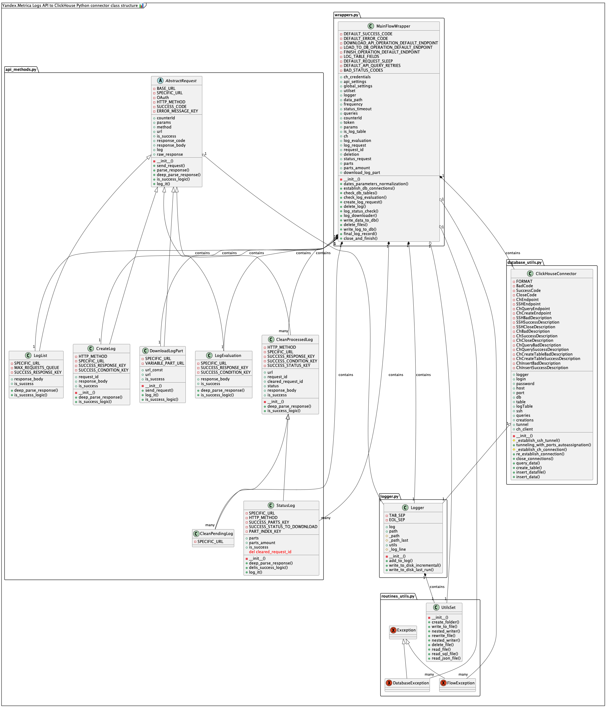

# :uk: Yandex.Metrica Logs API to ClickHouse Python connector :bar_chart:

  [Russian version|Русская версия](README.md)

  This extractor was developed by **ex-Yandex.Metrica employee** as a pet project during emigration's depression. In honour of all of my ex-colleagues. 

  <figure>
    <a href="diagrams/diagram.png">
      
    </a>
    <figcaption>Small UML of the project</figcaption>
  </figure>

  Concepts used: 
  - OOP; 
  - Factory pattern; 
  - Singletone pattern; 
  - Clean code with cool docstrings concept; 
  - Hate-driven development. 

---

## :running: Quick Start  

  Ensure you have **Python 3.10+**, **ClickHouse 25+ version** installed, and a database with at least one table created.  
  Then:  

  1. Install all dependencies by running: 
  ```bash 
  pip install -r requirements.txt
  ```
  2. Fill in the configuration files (`.json` files in config/folder). [See config files description](#closed_book-config-files-description).  
  3. Run `main.py`: 
  ```bash
    python3 main.py
  ``` 
  4. Enjoy your Logs API data in ClickHouse!  

---

## :green_book: General Description  

  Script to make request to [**Yandex Metrica Logs API**](https://yandex.com/dev/metrika/en/logs/) and upload Logs data in a **local** or **remote** [**ClickHouse**](https://clickhouse.com/) instance via SSH. **Currently supported only HTTP interface and SSH tunneling with login + password authorization, no keychains support yet**. 

  It works seamlessly with both:  
  - [**Sessions/Visits Table**](https://yandex.com/dev/metrika/en/logs/fields/visits)  
  - [**Events/Hits Table**](https://yandex.com/dev/metrika/en/logs/fields/visits)  

Configuration is determined via multiple JSON files. [See config files description](#closed_book-config-files-description).  

---

## :computer: Automation  
Extractor execution can be automated using:  
- **Cron Jobs**  
- **Apache Airflow**  
- **Any Other Orchestration Tool**  

---

## :question: Main functions of the script
1. Extractor downloads data in **TSV format** in folder, determined by `global_config.json` file. It would have used `gzip`, but, unfortunatelly,there is confirmed bug with `gzip` `accept-encoding` header on Metrica's Logs API side. 
2. Data then being loaded into a **local ClickHouse instance**.  
   - If `ssh` in `ch_credentials.json` is `null` or `false`, data is stored locally.  
   - If `ssh` is set, an SSH connection is established, and data is transmitted to a remote `ClickHouse` instance.  
3. After all, data is either deleted or stored for future purposes, see more in [`global_config.json`](#global_configjson) section. 

---

## :japanese_ogre: Prerequisites  
  Before running the extractor, ensure you have:  

1. A [**Yandex Metrica Tag**](https://yandex.com/support/metrica/general/creating-counter.html).  
2. A Yandex account with at least **view access** to the Metrica tag/counter. [More details](https://yandex.com/support/metrica/general/access.html#guest).  
3. A **Yandex OAuth Token** with access to Yandex.Metrica. [Generate one here](https://yandex.com/dev/metrika/en/intro/authorization#get-oauth-token).  
4. A **ClickHouse instance** installed:  
  - Locally  
  - Remotely, but remote host accessible via SSH ( login+password authorization supported)
  - In a Docker container (either local or remote)  
  - If using a **remote ClickHouse instance**, SSH connection details must be provided in `ch_credentials.json` (currently supports only login+password authorization).  
5. A **database and table created in ClickHouse**:  
  - Currently, the script works with **one database, one table, and one Logs API entity at a time** (either sessions or events).  
  - To handle multiple sources, duplicate the script with different configurations.  
  - You can either name columns like entities of Logs API visits/hits table, or make more human-readable names. I.e.: either `ym:s:visitID` or `visitID`. In former case you will have more flexablity: for LogsAPI config you can leave all the fields to download with random order and it will be mapped to table columns by names. In latter case, you will need to order API fields in the same order as columns ordered in your table in database and always check if you have the same amount of fields in your logs api config file and in your `ClickHouse` table. 
  - Recommended table engine: [`ReplacingMergeTree`](https://clickhouse.com/docs/engines/table-engines/mergetree-family/replacingmergetree) (suited for Metrica Logs API data, as there are no `Sign` or `ver` fields).  
  - Recommended primary key (order by) for visits:  

     ```sql
     ORDER BY (visitID, counterUserIDHash, counterID)
     ```
    *(Omit `counterID` if using only one counter.)*  

  - Recommended primary key (order by) for hits: 

     ```sql
     ORDER BY (watchID, counterUserIDHash, counterID)
     ```
    *(Omit `counterID` if using only one counter.)*  

  - This script can also write log of execution of the script itself to Log table in `ClickHouse`. To do that - set name of log table as a value of `logTable` parameter in [`ch_credentials.json`](#ch_credentialsjson). Log table should be created like this: 

    ```sql
    CREATE OR REPLACE TABLE db_name.log_table_name
    (	
        datetime 			DateTime NOT NULL, 
        response 			INT NOT NULL,
        endpoint			String NOT NULL, 
        description			String
    ) ENGINE = ReplacingMergeTree()
    PARTITION BY toYYYYMM(datetime)
    ORDER BY (datetime, response, endpoint);
    ```
6. **`Python 3.10+`** and the corresponding `pip3`.  
7. Dependencies will be downloaded from `requirements.txt` file with `pip` (or `pip3`): 
    ```bash
    pip install -r requirements.txt
    ``` 
8. Up to **20 gigabytes of free disk space**, as current implementation downloads all the data from the server and only then uploads it to DB.

---

## :closed_book: Config Files Description 

  This project relies on several JSON configuration files. All of them stored in `configs/` folder of the project.

### `api_credentials.json`
  - `token` *(string)*: Your Yandex OAuth token (e.g., `"token": "d2_eerr534"`). [How to get one](https://yandex.com/dev/metrika/en/intro/authorization#get-oauth-token).  
  - `counter` *(string)*: Your Yandex counter ID (e.g., `"counter": "123456"`). 
  - `date1` *(string, nullable)*:  Start date to request data for. Leave it `null` to be yesterday. 
  - `date2` *(string, nullable)*: End date to request data for. Maximum value - the day before current one (yesterday). Leave in `null` to be yesterday. You can set date1 distinctly and `date2` as `null` to request data since `date1` till yesterday, or set both `date1` and `date2` nulls to request data only for yesterday. 
  - `fields` *(string)*: Comma-separated listing of fields (either for [sessions](https://yandex.com/dev/metrika/en/logs/fields/visits) or [events](https://yandex.com/dev/metrika/en/logs/fields/hits)).  
  - `source` *(string)*: Either `"visits"` for sessions or `"hits"` for events. 
  - `attribution` *(string)*: By default `"LASTSIGN"`, [see full values list](https://yandex.com/dev/metrika/en/logs/param).

  ***Example of filled `api_credentials.json` file:***
  
  ```json
  {   
    "token":"y0_AgA45454545dfdfkdgkajtqe", 
    "counter": "12345678", 
    "date1": "2025-04-27",
    "date2": null,
    "fields":"ym:s:visitID,ym:s:counterID,ym:s:watchIDs,ym:s:date,ym:s:dateTime,ym:s:dateTimeUTC,ym:s:isNewUser,ym:s:startURL,ym:s:endURL,ym:s:pageViews,ym:s:visitDuration,ym:s:bounce,ym:s:ipAddress,ym:s:regionCountry,ym:s:regionCity,ym:s:regionCountryID,ym:s:regionCityID,ym:s:clientID,ym:s:counterUserIDHash,ym:s:networkType,ym:s:goalsID,ym:s:goalsSerialNumber,ym:s:goalsDateTime,ym:s:goalsPrice,ym:s:goalsOrder,ym:s:goalsCurrency,ym:s:<attribution>TrafficSource,ym:s:<attribution>AdvEngine,ym:s:<attribution>ReferalSource,ym:s:<attribution>SearchEngineRoot,ym:s:<attribution>SearchEngine,ym:s:<attribution>SocialNetwork,ym:s:<attribution>SocialNetworkProfile,ym:s:referer,ym:s:<attribution>DirectClickOrder,ym:s:<attribution>DirectBannerGroup,ym:s:<attribution>DirectClickBanner,ym:s:<attribution>DirectClickOrderName,ym:s:<attribution>ClickBannerGroupName,ym:s:<attribution>DirectClickBannerName,ym:s:<attribution>DirectPhraseOrCond,ym:s:<attribution>DirectPlatformType,ym:s:<attribution>DirectPlatform,ym:s:<attribution>DirectConditionType,ym:s:<attribution>CurrencyID,ym:s:from,ym:s:<attribution>UTMCampaign,ym:s:<attribution>UTMContent,ym:s:<attribution>UTMMedium,ym:s:<attribution>UTMSource,ym:s:<attribution>UTMTerm,ym:s:<attribution>openstatAd,ym:s:<attribution>openstatCampaign,ym:s:<attribution>openstatService,ym:s:<attribution>openstatSource,ym:s:<attribution>hasGCLID,ym:s:<attribution>GCLID,ym:s:browserLanguage,ym:s:browserCountry,ym:s:clientTimeZone,ym:s:deviceCategory,ym:s:mobilePhone,ym:s:mobilePhoneModel,ym:s:operatingSystemRoot,ym:s:operatingSystem,ym:s:browser,ym:s:browserMajorVersion,ym:s:browserMinorVersion,ym:s:browserEngine,ym:s:browserEngineVersion1,ym:s:browserEngineVersion2,ym:s:browserEngineVersion3,ym:s:browserEngineVersion4,ym:s:cookieEnabled,ym:s:javascriptEnabled,ym:s:screenFormat,ym:s:screenColors,ym:s:screenOrientation,ym:s:screenOrientationName,ym:s:screenWidth,ym:s:screenHeight,ym:s:physicalScreenWidth,ym:s:physicalScreenHeight,ym:s:windowClientWidth,ym:s:windowClientHeight,ym:s:purchaseID,ym:s:purchaseDateTime,ym:s:purchaseAffiliation,ym:s:purchaseRevenue,ym:s:purchaseTax,ym:s:purchaseShipping,ym:s:purchaseCoupon,ym:s:purchaseCurrency,ym:s:purchaseProductQuantity,ym:s:eventsProductID,ym:s:eventsProductList,ym:s:eventsProductBrand,ym:s:eventsProductCategory,ym:s:eventsProductCategory1,ym:s:eventsProductCategory2,ym:s:eventsProductCategory3,ym:s:eventsProductCategory4,ym:s:eventsProductCategory5,ym:s:eventsProductVariant,ym:s:eventsProductPosition,ym:s:eventsProductPrice,ym:s:eventsProductCurrency,ym:s:eventsProductCoupon,ym:s:eventsProductQuantity,ym:s:eventsProductEventTime,ym:s:eventsProductType,ym:s:eventsProductDiscount,ym:s:eventsProductName,ym:s:productsPurchaseID,ym:s:productsID,ym:s:productsName,ym:s:productsBrand,ym:s:productsCategory,ym:s:productsCategory1,ym:s:productsCategory2,ym:s:productsCategory3,ym:s:productsCategory4,ym:s:productsCategory5,ym:s:productsVariant,ym:s:productsPosition,ym:s:productsPrice,ym:s:productsCurrency,ym:s:productsCoupon,ym:s:productsQuantity,ym:s:productsList,ym:s:productsEventTime,ym:s:productsDiscount,ym:s:impressionsURL,ym:s:impressionsDateTime,ym:s:impressionsProductID,ym:s:impressionsProductName,ym:s:impressionsProductBrand,ym:s:impressionsProductCategory,ym:s:impressionsProductCategory1,ym:s:impressionsProductCategory2,ym:s:impressionsProductCategory3,ym:s:impressionsProductCategory4,ym:s:impressionsProductCategory5,ym:s:impressionsProductVariant,ym:s:impressionsProductPrice,ym:s:impressionsProductCurrency,ym:s:impressionsProductCoupon,ym:s:impressionsProductList,ym:s:impressionsProductQuantity,ym:s:impressionsProductEventTime,ym:s:impressionsProductDiscount,ym:s:promotionID,ym:s:promotionName,ym:s:promotionCreative,ym:s:promotionPosition,ym:s:promotionCreativeSlot,ym:s:promotionEventTime,ym:s:promotionType,ym:s:offlineCallTalkDuration,ym:s:offlineCallHoldDuration,ym:s:offlineCallMissed,ym:s:offlineCallTag,ym:s:offlineCallFirstTimeCaller,ym:s:offlineCallURL,ym:s:parsedParamsKey1,ym:s:parsedParamsKey2,ym:s:parsedParamsKey3,ym:s:parsedParamsKey4,ym:s:parsedParamsKey5,ym:s:parsedParamsKey6,ym:s:parsedParamsKey7,ym:s:parsedParamsKey8,ym:s:parsedParamsKey9,ym:s:parsedParamsKey10,ym:s:<attribution>RecommendationSystem,ym:s:<attribution>Messenger",
    "source":"visits", 
    "attribution": "LASTSIGN"
  }
  ```

### `ch_credentials.json`
  - `login` *(string)*: `ClickHouse` login.  
  - `password` *(string)*: `ClickHouse` password.  
  - `host` *(string)*: `ClickHouse` host address.  
  - `port` *(integer)*: `ClickHouse` port. Or local port to be bonded with remote `SSH` port. Can be `null` to automatically choose local port to bond.   
  - `db` *(string)*: `ClickHouse` database name.  
  - `table` *(string)*: `ClickHouse` table name.  
  - `logTable` *(string)*: `ClickHouse` table name for log of the script run. 
  - `ssh` *(null or dictionary)*: If null, data is loaded locally. If provided, `SSH` credentials must be specified. 

  ***Exmaple of `ch_credentials.json` file without ssh connection:***
  ```json
  {
    "login":"default", 
    "password": "",
    "host": "localhost",  
    "port": 8123, 
    "db": "debuging", 
    "table": "visits2",
    "logTable": "extractor_log",
    "ssh": null
  }
  ```  
  But if you need `SSH` connection, instead null set `SSH` connection properties: 
    - `login`: `SSH` username.  
    - `password`: `SSH` password.  
    - `host`: Remote machine hostname or `IP`.  
    - `port`: ssh port (usually - 22).  
    - `remote_port_bind`: Remote `ClickHouse` `HTTP` interface port (default **`8123`**). [More details](https://clickhouse.com/docs/en/interfaces/http#http-interface). Currently only HTTP supported. 

  ***Example of ssh sub-json:***
  ```json
  "ssh": {
    "login": "your_ssh_username",
    "password": "your_ssh_password",
    "host": "remote_host_address",
    "port": 22,
    "remote_port_bind": 8123
  }
  ``` 

### `global_config.json`

  Contains the following settings:

  - `log_continuous_path`: Path to the script's log file. Stores the history of all script runs.  
  The set folder may not exist initially — you can create it manually, or the script will create it automatically.  
  Default: `"logs/logs.log"`. 

  - `log_last_run_path`: Path to the script's last run log file. Stores information only about the last run.  
  Default: `"logs/last_run.log"`.

  - `temporary_data_path`: Directory to store downloaded CSV files from the Logs API.  
  Each file will be named using the formula: `datetime-counterId-source(hits/visits)-part{part_number}.tsv`  
  Example: `2025-06-10 11:24:25-12345678-visits-part9.tsv`
  Default: `"data/"`. 
  - `delete_temp_data`: Boolean. If `true`, deletes downloaded data after processing. If `false`, keeps it for future use.  
  Default: `true`.

  - `delete_not_uploaded_to_db_temp_data`: Boolean. If `true` and `delete_temp_data` is also `true`, excludes files that weren't successfully uploaded to ClickHouse from deletion.  
  Default: `true`.

  - `api_strict_db_table_cols_names`: Boolean. If `true`, maps columns by name (not order) — only matching columns will be written to the database.  
    If `false`, all fields from the Logs API will be written to ClickHouse in the same order as the database expects, so the order of fields becomes critical.  
  Default: `false`.

  - `run_db_table_test`: Boolean. If `true`, performs a basic test to check if the database and table exist.  
    - If `continue_on_columns_test_fail` is `false` and the number of columns in the database does not match `api_credentials.json`, the script throws an error and stops.  
    - If `continue_on_columns_test_fail` is `true`, the script continues, assuming column names match and `api_strict_db_table_cols_names` is enabled.  
    - If the database or table doesn't exist, an error is raised and the script stops.  
  Default: `true`.

  - `continue_on_columns_test_fail`: Boolean. Only relevant if `run_db_table_test` is `true`.  
    If `true`, continues script execution even if the column count in the database and the parameters in `api_credentials.json` differ.  
    Works correctly only if column names match and `api_strict_db_table_cols_names` is also `true`.  
  Default: `false`.

  - `run_log_table_test`: Boolean. If `true`, verifies that the log table specified in `ch_credentials.json` (`logTable` param) exists and has the expected columns.  
    If `false`, this check is skipped.  
  Default: `true`.

  - `create_log_table_on_fail`: Boolean. If `true`, creates the `logTable` (as specified in `ch_credentials.json`) if it doesn't exist.  
    If `false`, table creation is skipped, and logs won't be written to the table.  
  Default: `true`.

  - `continue_on_log_table_creation_fail`: Boolean. If `true`, continues execution even if the `logTable` is missing or has incorrect columns.  
    In this case, logs won't be saved to the database.  
  Default: `true`.

  - `clear_api_queue`: Boolean. If `true`, clears the Logs API queue (both prepared and pending requests) to free space for new requests.  
    If `false`, existing requests are preserved, but creating a new request may fail due to lack of space.  
  Default: `true`.

  - `clear_created_logs_request`: Boolean. If `true`, deletes the Logs API request created during the current script run.  
    This ensures cleanup and avoids leaving orphaned requests.  
  Default: `true`.

  - `frequency_api_status_check_sec`: Integer. Defines how often (in seconds) the script checks if the Logs API request is ready for download or still pending.  
  Default: `30`.

  - `api_status_wait_timeout_min`: Integer. Maximum time (in minutes) the script waits for the Logs API request to be prepared.  
  Default: `30`.

  - `data_loss_tolerance_perc`: Integer. Sets the maximum allowable percentage of data loss (data that couldn't be downloaded from the Metrica server).  
  Default: `10`.

  - `bad_data_tolerance_perc`: Integer. Sets the maximum allowable percentage of data that can fail to be written to the database without raising an error.  
  Default: `15`.

  - `absolute_db_format_errors_tolerance`: Integer. Maximum number of formatting errors allowed when uploading a single file to the database before an error is raised.  
  Default: `10`.

    **Example of `global_config.json`:**
    ```json
    {
      "log_continuous_path": "logs/logs.log",
      "log_last_run_path": "logs/last_run.log",
      "temporary_data_path": "data/",
      "delete_temp_data": true,
      "delete_not_uploaded_to_db_temp_data": true,
      "api_strict_db_table_cols_names": true,
      "run_db_table_test": true,
      "continue_on_columns_test_fail": true,
      "run_log_table_test": true,
      "create_log_table_on_fail": true,
      "continue_on_log_table_creation_fail": true,
      "clear_api_queue": true,
      "clear_created_logs_request": true,
      "frequency_api_status_check_sec": 30,
      "api_status_wait_timeout_min": 30,
      "data_loss_tolerance_perc": 10,
      "bad_data_tolerance_perc": 15,
      "absolute_db_format_errors_tolerance": 10
    }
    ```

---

## :notebook: Modules description

  For more details about classes relations see [UML diagram]().

  ### 1. `main.py`
  Located in the root directory of the project. Import all the necessary modules and executes the script: reads inputs, performs queries, logs the steps, uploads data to `ClickHouse` and makes all the necessary steps. 

  ### 2. `routines_utils.py`
  Located in `utils/` subfolder of the project. Defines 2 custom exceptions: `DatabaseException` and `FlowException` and a class `UtilSet` with set of methods that allow to speed up routine operations like read of files of different formats, writings to files and rewritings of files. 

  ### 3. `logger.py`
  Located in `utils/` subfolder of the project. Defines `Logger` class that logs data and then writes it both locally and/or to the `ClickHouse` table. 

  ### 4. `database_utils.py`
  Located in `utils/` subfolder of the project. Defines `ClickHouseConnector` class to easily manage connection to the database, SSH tunneling with methods to perform queriing operations, inserts. close connections and so on. 

  ### 5. `api_methods.py`
  Located in `utils/` subfolder of the project. Defines set of classes-singletones inherited from `AbstractRequest` each of them performs one [LogsAPI request](https://yandex.com/dev/metrika/en/logs/openapi/getLogRequests). 

  ### 6. `wrappers.py`
  Located in `utils/` subfolder of the project. Defines `MainFlowWrapper` class, that controls execution flow of the script. Honestly speaking, not necessary class :new_moon_with_face: that indicates extreme patternalism of the author :new_moon_with_face: :new_moon_with_face: :new_moon_with_face:. Still, it wraps methods and operations in safe try-except/finally blocks to perform logging and to trow proper exceptions. 

---

## :minidisc: Queries description

  There are 6 quries in `queries/` subfolder of the project. Most of them - `DML` (precisely - `SELECT`) queries to perform shallow checks of database and tables (both data and log table).

  ### 1. `query_database.sql`
  `SELECT` query to check if database set as `db` parameter of [`ch_credentials.json`](#ch_credentialsjson) exists. 

  ### 2. `query_table.sql` 
  `SELECT` query to check if table set as `table` parameter of [`ch_credentials.json`](#ch_credentialsjson) exists. 

  ### 3. `query_columns.sql`
  `SELECT` query to select all the columns of the table from p2. This is key point of shallow check: it will then check amount of columns from database with amount of Logs API parameters in `api_credentials.json` file. Succesfull test pass means these amounts matchs, basically. 

  ### 4. `query_log_table.sql` 
  `SELECT` query to check if log table set as `logTable` parameter of [`ch_credentials.json`](#ch_credentialsjson) exists. 

  ### 5. `query_log_table_columns.sql`
  `SELECT` query to check log table columns. 

  ### 6. `create_log_table.sql`
  DDL query (`CREATE`) to create or replace log table if it doesn't exist or exists but with incorrect columns. Can and definitely will rewrite table with the same name if it exists. 


---

## :rage2: Possible nonsense configs combinations :new_moon_with_face:. 

  1. Definitely,  that's worthless to have custom names of the columns of `ClickHouse` with `global_config.json` parameter `"api_strict_db_table_cols_names"`: `true` as it will cause situation, when data won't be written to databse. 

  2. Also, if you have custom columns names and amount of columns doesn't match with amount of requested fields of Logs API,  with `global_config.json` parameters `"api_strict_db_table_cols_names"`: `false` but with `"run_db_table_test"`: `false` - it will cause db shallow test will be skipped, data will be downloaded, but not written. 

  3. Similar to previous one, but with `global_config.json` parameters `"run_db_table_test"`: `true` and  `"continue_on_columns_test_fail"`: `true`, as it will, again, cause data to be downloaded, but not written to database. 

  List to be continued. 
      
     


